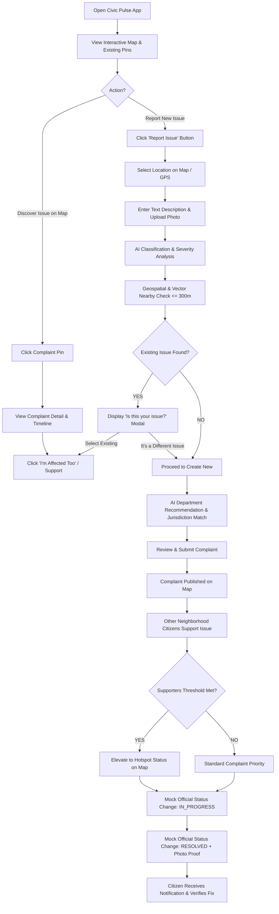
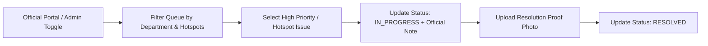

# 03 — User Journeys & Golden Path

This document specifies the primary citizen user journey and the secondary mock official journey. The implementation must ensure the **Golden Path** is seamless and frictionless end-to-end.

---

## 1. Primary Citizen Journey (Golden Path Diagram)

---

## 2. Step-by-Step Golden Path Specifications

### Step 1: Open App & Map Discovery
- **User Action**: Citizen opens `https://civicpulse.vercel.app`.
- **System Behavior**: Application loads map centered on default/user geolocation. Active complaints display as color-coded pins. Nearby hotspots render as translucent pulse rings.

### Step 2: Location & Description Input
- **User Action**: Citizen clicks "+ Report Issue", selects pin location on map, types description (e.g. *"Huge pothole near Karve Road junction causing severe traffic slow-down"*), and attaches a photo.

### Step 3: AI Processing & Advisory Review
- **System Behavior**: Backend sends text and photo to OpenAI API. AI returns structured JSON:
  - **Category**: `Roads & Traffic`
  - **Severity**: `HIGH`
  - **Summary**: `Hazardous pothole blocking traffic flow`
- **UI Render**: Shows AI recommendation screen with editable options.

### Step 4: Nearby Duplicate Check
- **System Behavior**: PostGIS queries database for open complaints within 300m. OpenAI embedding compares semantic similarity.
- **UI Render**: If match found (>70% similarity), displays **"Is this problem already reported?"** screen with photos and distance.
- **User Options**:
  - `Option A`: **"Yes, I'm affected too"** → Increments supporter count on existing ticket.
  - `Option B`: **"No, report as new issue"** → Proceeds with creation.

### Step 5: Creation & Department Routing
- **System Behavior**: Issue is saved in database with status `SUBMITTED`, mapped to recommended department (e.g. `Roads & Maintenance Department`). Map pin appears instantly.

### Step 6: Community Upvoting & Hotspot Escalation
- **System Behavior**: As neighbors view and click "Support", supporter count increments. When a cluster of 5+ reports or 20+ supporters accumulate within 300m, system elevates cluster to **Hotspot** status.

### Step 7: Mock Government Action & Resolution Verification
- **User Action (Mock Official)**: Uses admin toggle to change status to `IN_PROGRESS` and subsequently `RESOLVED` with a resolution proof photo.
- **System Behavior**: Timeline updates with `source: GOVERNMENT`. Citizen views resolution proof and clicks "Verify Fix".

---

## 3. Secondary Journey: Mock Government Official

