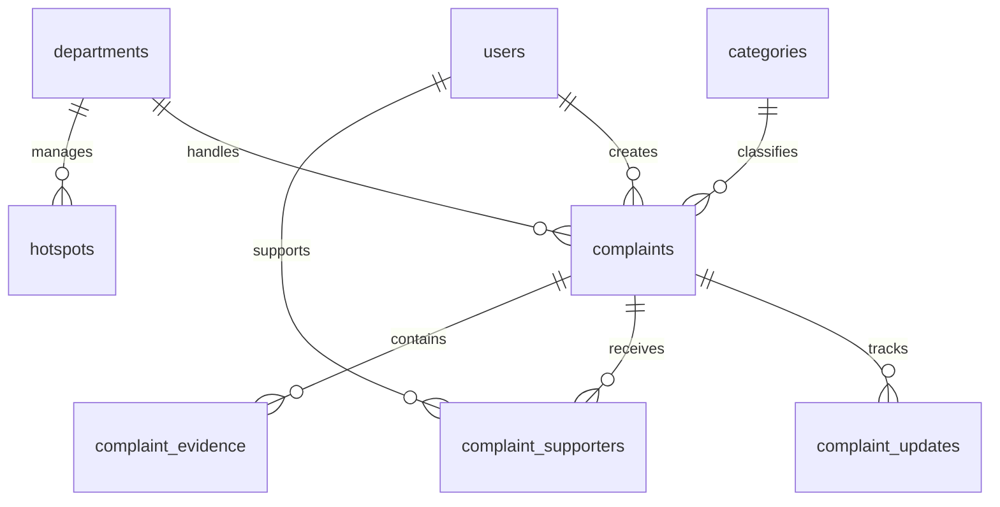

# 05 — Database Schema Specifications

This document defines the complete PostgreSQL database schema for **Civic Pulse**, including PostGIS spatial extension types, pgvector vector columns, relationships, and source tagging.

---

## 1. Database Extensions

```sql
-- Enable PostGIS for geospatial queries
CREATE EXTENSION IF NOT EXISTS postgis;

-- Enable pgvector for semantic text embeddings
CREATE EXTENSION IF NOT EXISTS vector;

-- Enable UUID generation
CREATE EXTENSION IF NOT EXISTS "uuid-ossp";
```

---

## 2. Entity Relational Diagram (ERD)



---

## 3. Detailed DDL Specifications

### A. `users`
Stores user profile information for citizens and mock government officials.
```sql
CREATE TABLE users (
    id UUID PRIMARY KEY DEFAULT uuid_generate_v4(),
    email TEXT UNIQUE NOT NULL,
    full_name TEXT NOT NULL,
    avatar_url TEXT,
    role TEXT NOT NULL DEFAULT 'CITIZEN' CHECK (role IN ('CITIZEN', 'OFFICIAL', 'ADMIN')),
    created_at TIMESTAMPTZ DEFAULT NOW(),
    updated_at TIMESTAMPTZ DEFAULT NOW()
);
```

### B. `categories`
Civic issue classification categories.
```sql
CREATE TABLE categories (
    id UUID PRIMARY KEY DEFAULT uuid_generate_v4(),
    name TEXT UNIQUE NOT NULL,
    slug TEXT UNIQUE NOT NULL,
    icon_name TEXT NOT NULL,
    description TEXT,
    default_department_id UUID,
    created_at TIMESTAMPTZ DEFAULT NOW()
);
```

### C. `departments`
Municipal departments responsible for resolving issues.
```sql
CREATE TABLE departments (
    id UUID PRIMARY KEY DEFAULT uuid_generate_v4(),
    name TEXT UNIQUE NOT NULL,
    code TEXT UNIQUE NOT NULL,
    contact_email TEXT,
    jurisdiction_bounds GEOMETRY(Polygon, 4326),
    created_at TIMESTAMPTZ DEFAULT NOW()
);
```

### D. `complaints`
Core civic issue entity with spatial coordinates and AI metadata.
```sql
CREATE TABLE complaints (
    id UUID PRIMARY KEY DEFAULT uuid_generate_v4(),
    user_id UUID REFERENCES users(id) ON DELETE SET NULL,
    category_id UUID REFERENCES categories(id),
    department_id UUID REFERENCES departments(id),
    title TEXT NOT NULL,
    description TEXT NOT NULL,
    latitude DOUBLE PRECISION NOT NULL,
    longitude DOUBLE PRECISION NOT NULL,
    location_geometry GEOMETRY(Point, 4326) GENERATED ALWAYS AS (ST_SetSRID(ST_MakePoint(longitude, latitude), 4326)) STORED,
    location_name TEXT NOT NULL,
    severity TEXT NOT NULL DEFAULT 'MEDIUM' CHECK (severity IN ('LOW', 'MEDIUM', 'HIGH', 'CRITICAL')),
    status TEXT NOT NULL DEFAULT 'SUBMITTED' CHECK (status IN ('SUBMITTED', 'UNDER_REVIEW', 'IN_PROGRESS', 'RESOLVED', 'REJECTED')),
    ai_category TEXT,
    ai_department TEXT,
    ai_confidence DOUBLE PRECISION,
    image_urls TEXT[] DEFAULT '{}',
    embedding vector(1536),
    supporters_count INTEGER DEFAULT 1,
    created_at TIMESTAMPTZ DEFAULT NOW(),
    updated_at TIMESTAMPTZ DEFAULT NOW()
);
```

### E. `complaint_supporters`
Tracks citizens who support an existing complaint ("I'm affected too").
```sql
CREATE TABLE complaint_supporters (
    id UUID PRIMARY KEY DEFAULT uuid_generate_v4(),
    complaint_id UUID NOT NULL REFERENCES complaints(id) ON DELETE CASCADE,
    user_id UUID NOT NULL REFERENCES users(id) ON DELETE CASCADE,
    created_at TIMESTAMPTZ DEFAULT NOW(),
    UNIQUE(complaint_id, user_id)
);
```

### F. `complaint_updates` (Audit & Timeline Table)
Chronological lifecycle updates. **CRITICAL**: The `source` column strictly separates Citizen inputs, Government actions, System triggers, and AI inferences.
```sql
CREATE TABLE complaint_updates (
    id UUID PRIMARY KEY DEFAULT uuid_generate_v4(),
    complaint_id UUID NOT NULL REFERENCES complaints(id) ON DELETE CASCADE,
    user_id UUID REFERENCES users(id),
    status TEXT NOT NULL CHECK (status IN ('SUBMITTED', 'UNDER_REVIEW', 'IN_PROGRESS', 'RESOLVED', 'REJECTED')),
    message TEXT NOT NULL,
    image_url TEXT,
    source TEXT NOT NULL CHECK (source IN ('CITIZEN', 'GOVERNMENT', 'SYSTEM', 'AI')),
    created_at TIMESTAMPTZ DEFAULT NOW()
);
```

### G. `complaint_evidence`
Additional photos or documentation uploaded by community members.
```sql
CREATE TABLE complaint_evidence (
    id UUID PRIMARY KEY DEFAULT uuid_generate_v4(),
    complaint_id UUID NOT NULL REFERENCES complaints(id) ON DELETE CASCADE,
    user_id UUID REFERENCES users(id),
    image_url TEXT NOT NULL,
    description TEXT,
    source TEXT NOT NULL DEFAULT 'CITIZEN' CHECK (source IN ('CITIZEN', 'GOVERNMENT', 'SYSTEM', 'AI')),
    created_at TIMESTAMPTZ DEFAULT NOW()
);
```

### H. `hotspots`
Aggregated high-density/high-severity civic issue hotspots.
```sql
CREATE TABLE hotspots (
    id UUID PRIMARY KEY DEFAULT uuid_generate_v4(),
    title TEXT NOT NULL,
    category_id UUID REFERENCES categories(id),
    department_id UUID REFERENCES departments(id),
    center_latitude DOUBLE PRECISION NOT NULL,
    center_longitude DOUBLE PRECISION NOT NULL,
    center_geometry GEOMETRY(Point, 4326) GENERATED ALWAYS AS (ST_SetSRID(ST_MakePoint(center_longitude, center_latitude), 4326)) STORED,
    radius_meters DOUBLE PRECISION DEFAULT 300.0,
    complaint_count INTEGER DEFAULT 1,
    severity_score DOUBLE PRECISION DEFAULT 1.0,
    status TEXT DEFAULT 'ACTIVE' CHECK (status IN ('ACTIVE', 'ADDRESSING', 'RESOLVED')),
    created_at TIMESTAMPTZ DEFAULT NOW(),
    updated_at TIMESTAMPTZ DEFAULT NOW()
);
```

---

## 4. Indexes & Performance Optimization

```sql
-- PostGIS Spatial Index for ultra-fast radius searches (ST_DWithin)
CREATE INDEX idx_complaints_location_geo ON complaints USING GIST (location_geometry);
CREATE INDEX idx_hotspots_center_geo ON hotspots USING GIST (center_geometry);

-- Filter Indexes
CREATE INDEX idx_complaints_status ON complaints(status);
CREATE INDEX idx_complaints_category ON complaints(category_id);
CREATE INDEX idx_complaints_created_at ON complaints(created_at DESC);

-- Vector Similarity Index for pgvector
CREATE INDEX idx_complaints_embedding ON complaints USING ivfflat (embedding vector_cosine_ops) WITH (lists = 100);
```
